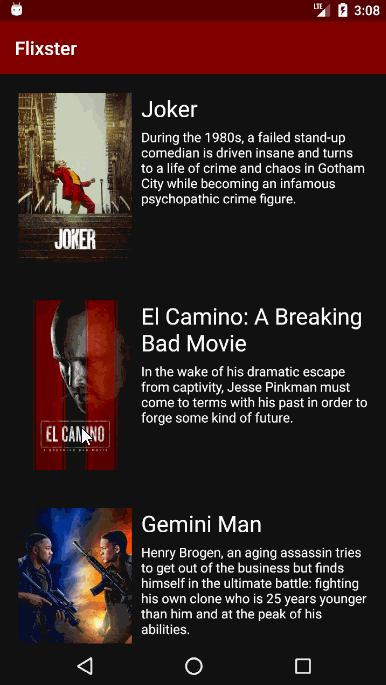

# *Flix*
Flix is an Android app that allows users to browse movies from the [The Movie Database API](http://docs.themoviedb.apiary.io/#).

## Features
* User can view a list of movies (title, poster image, and overview) currently playing in theaters from the Movie Database API.
* Exposed details of movie (ratings using RatingBar, popularity, and synopsis) in a separate activity.
* Used Heterogenous RecyclerViews and different ViewHolder layout files for popular movies and less popular ones.
* User can view trailers for each movie.
* Views are responsive for both landscape/portrait mode.
* Improved the user interface by experimenting with styling and coloring.

### App Walkthough

 

GIF created with [LiceCap](http://www.cockos.com/licecap/).

## Open-source libraries used
- [Android Async HTTP](https://github.com/codepath/CPAsyncHttpClient) - Simple asynchronous HTTP requests with JSON parsing
- [Glide](https://github.com/bumptech/glide) - Image loading and caching library for Android
